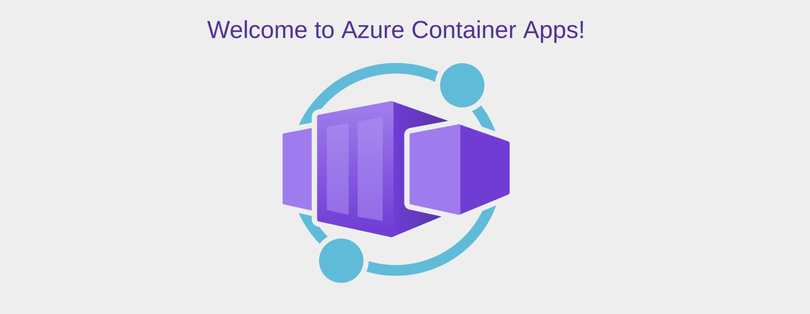
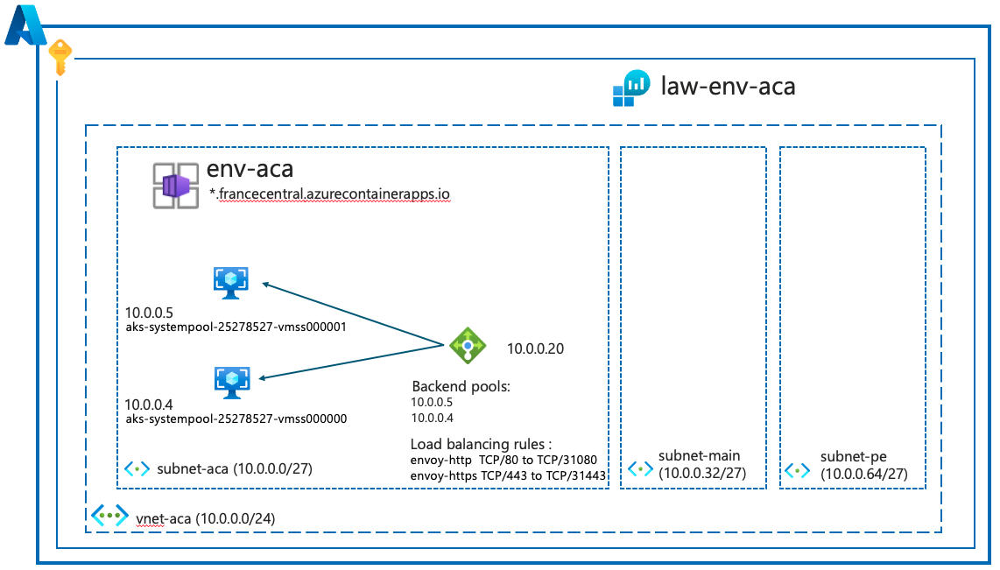

# Introduction "Azure Container Apps"
<br>
# Introduction

Azure Container Apps est un service d’Azure qui a été officiellement annoncé lors de l'événement __Microsoft Ignite 2021__ et est devenu GA en mai 2022.<br><br>
__Azure Container Apps__ est un service de plateforme d'applications « Serverless » qui permet de déployer et d'exécuter des applications conteneurisées de manière simplifiée, __sans gérer l'infrastructure sous-jacente__ qui n’es ni plus ni moins que les services Azure Kubernetes Services (pas besoin d’être un expert en orchestrateur de containeurs).<br><br>
Microsoft propose ce service pour les scenarios suivant :
* Applications web et API
* Traitement de tâches en arrière-plan
* Microservices
* Applications basées sur des événements

Azure Container Apps est packagé avec __KEDA__ (Autoscaler) et __ENVOY__ (edge HTTP proxy)<br>
Les applications construites sur Azure Container Apps peuvent évoluer dynamiquement en fonction des caractéristiques suivantes :
* HTTP traffic
* Event-driven processing
* CPU or memory load
* Any KEDA-supported scaler

Dans Azure Container Apps on dispose également d'une version managée des API Dapr. Les API Dapr disponibles incluent "Service to Service calls", "Pub/Sub", "Event Bindings", "State Stores"et "Actors".https://learn.microsoft.com/en-us/azure/container-apps/microservices-dapr

Ce service interressant évolue assez vite, Microsoft publie ici la Roadmap : https://github.com/orgs/microsoft/projects/540

# Quelques concepts
__1/ Plans__<br>
Azure Container Apps propose deux types de plans :<br><br>
Plan « Dedicated »:<br>
Le plan dédié consiste en une série de profils de charge de travail qui vont du profil de consommation par défaut à des profils qui disposent d'un matériel dédié personnalisé pour des besoins de calcul spécialisés.<br><br>
Plan « Consumption »:<br>
Le plan Consommation propose une architecture « serverless » qui permet à vos applications d'évoluer à la demande. Les applications peuvent évoluer jusqu'à zéro, et vous ne payez que pour les applications en cours d'exécution. Utilisez le plan de consommation lorsque vous n'avez pas d'exigences matérielles spécifiques pour votre application de conteneur.<br><br>
__2/ Environnement__<br>
Un environnement Container Apps est un périmètre sécurisé autour d'une ou plusieurs applications et tâches conteneurisées.<br>
Un réseau virtuel prend en charge chaque environnement. Lorsque que l’on créer un environnement Azure Container Apps créée un Vnet ( qui n’est pas visible dans la console), on peut également venir également avec son propre Vnet/Subnet pour des configurations plus complexes ( bastion, Private End Point , ….)<br>
Lorsque plusieurs applications conteneurisées se trouvent dans le même environnement, elles partagent le même réseau virtuel et écrivent les journaux vers la même destination.<br>
Il faut comprendre qu'un "Container Apps Environment" est l'environnement (AKS) sur lequel on déplpoie les applications conteneurisées (uniquement sous linux).
Quand on déploie un "Container Apps Environment", on paramètre : - La "zone reduncy"(uniquement s'il y a une intégration avec un vNet) - les Workload profiles (plans) - le monitoring pour les Logs (Azure Log Analytics / Azure Monitor / Pas de stockage de Logs). - Networking, s'il on souhaite utiliser l'intégration d'un Virtual Network, s'il on souhaite exposer la "Virtual IP" à l'extérieur ou pas. (Internal/External)<br>
Selon vos besoins, on peut utiliser un ou plusieurs environnements Container Apps.<br>
En résumer<br>
On utilise __un environnement__ pour :<br>
- Déployer différentes applications sur le même VNet
- Instrumenter les applications Dapr qui communiquent via l'API d'invocation de services Dapr et partage la même configuration Dapr
- Faire en sorte que les applications partagent la même destination de journal de logs<br>

On utilise __plusieurs environnements__ pour :<br>
- Pour que les applications ne partagent pas les mêmes resources (compute/mémoire/…)
- Pour que les applications ne partagent pas l’API de Dapr
- On recherche une isolation totale (Équipe, environnement test, production,  ….)

Voici les propriétés d'un "Container Apps Environment":
```
az containerapp env show \
   --name $CONTAINERAPPS_ENVIRONMENT \
   --resource-group $RESOURCE_GROUP_NAME
```

```
{
  "id": "/subscriptions/xxxxxxxx-xxxx-xxxx-xxxx-xxxxxxxxxxxx/resourceGroups/rg-aca-az-cli/providers/Microsoft.App/managedEnvironments/env-aca",
  "location": "France Central",
  "name": "env-aca",
  "properties": {
    "appInsightsConfiguration": null,
    "appLogsConfiguration": {
      "destination": "log-analytics",
      "logAnalyticsConfiguration": {
        "customerId": "f6a62853-033c-4708-9c2c-066e070c35ed",
        "dynamicJsonColumns": false,
        "sharedKey": null
      }
    },
    "customDomainConfiguration": {
      "certificateKeyVaultProperties": null,
      "certificatePassword": null,
      "certificateValue": null,
      "customDomainVerificationId": "BB11B0C6B0BA3E3FBDD33887C540CD512FDF5D968AD7A552378FEACADAB27370",
      "dnsSuffix": null,
      "expirationDate": null,
      "subjectName": null,
      "thumbprint": null
    },
    "daprAIConnectionString": null,
    "daprAIInstrumentationKey": null,
    "daprConfiguration": {
      "version": "1.12.5"
    },
    "defaultDomain": "jollybeach-36002f2f.francecentral.azurecontainerapps.io",
    "eventStreamEndpoint": "https://francecentral.azurecontainerapps.dev/subscriptions/xxxxxxxx-xxxx-xxxx-xxxx-xxxxxxxxxxxx/resourceGroups/rg-aca-az-cli/managedEnvironments/env-aca/eventstream",
    "infrastructureResourceGroup": "ME_env-aca_rg-aca-az-cli_francecentral",
    "kedaConfiguration": {
      "version": "2.15.1"
    },
    "openTelemetryConfiguration": null,
    "peerAuthentication": {
      "mtls": {
        "enabled": false
      }
    },
    "peerTrafficConfiguration": {
      "encryption": {
        "enabled": false
      }
    },
    "provisioningState": "Succeeded",
    "publicNetworkAccess": "Disabled",
    "staticIp": "10.0.0.20",
    "vnetConfiguration": {
      "dockerBridgeCidr": null,
      "infrastructureSubnetId": "/subscriptions/xxxxxxxx-xxxx-xxxx-xxxx-xxxxxxxxxxxx/resourceGroups/rg-aca-az-cli/providers/Microsoft.Network/virtualNetworks/vnet-aca/subnets/subnet-aca",
      "internal": true,
      "platformReservedCidr": null,
      "platformReservedDnsIP": null
    },
    "workloadProfiles": [
      {
        "name": "Consumption",
        "workloadProfileType": "Consumption"
      }
    ],
    "zoneRedundant": false
  },
  "resourceGroup": "rg-aca-az-cli",
  "systemData": {
    "createdAt": "2024-10-21T13:55:55.7306081",
    "createdBy": "pierre.chesne@cellenza.com",
    "createdByType": "User",
    "lastModifiedAt": "2024-10-21T13:55:55.7306081",
    "lastModifiedBy": "pierre.chesne@cellenza.com",
    "lastModifiedByType": "User"
  },
  "type": "Microsoft.App/managedEnvironments"
}
```
On peut remarquer ci-dessus quelques informations interressantes: la "staticIp" (la "Virtual IP" ) - le "defaultDomain" (blabla-aleatoire.region.azurecontainerapps.io). Chaque conteneurs dans l'environnement aura le nom nomduconteneur.labla-aleatoire.region.azurecontainerapps.io<br><br>

Exemple de code d'un déploiement "Container Apps Environment" dans un vNet existant:<br>
- Création d'un "resource group"
- Création d'un Vnet et trois Subnet (dont un avec un "Delegate to Microsoft.App/environments)
- Création d'un "Log Analytics workspace"
- Récupération de l'ID et d'une Key du "Log Analytics workspace"
- Récupération de l'ID du subnet pour joindre le "Container Apps Environment"
- Création du "Container Apps Environment" (https://learn.microsoft.com/en-us/cli/azure/containerapp/env?view=azure-cli-latest#az-containerapp-env-create)

```
RESOURCE_GROUP_NAME="rg-aca-az-cli"
LOCATION="francecentral"

VNET_NAME="vnet-aca"
PREFIX_VNET="10.0.0.0/24"
SUBNET_ACA_NAME="subnet-aca"
PREFIX_SUBNET_ACA="10.0.0.0/27"
SUBNET_MAIN_NAME="subnet-main"
PREFIX_SUBNET_MAIN="10.0.0.32/27"
SUBNET_PE_NAME="subnet-pe"
PREFIX_SUBNET_PE="10.0.0.64/27"
CONTAINERAPPS_ENVIRONMENT="env-aca"

echo "Creating the resource group..."
az group create \
    --name $RESOURCE_GROUP_NAME \
    --location $LOCATION \
    --tags "env=test"

echo "Creating the virtual network..."
az network vnet create \
    --name $VNET_NAME \
    --resource-group $RESOURCE_GROUP_NAME \
    --location $LOCATION \
    --address-prefix $PREFIX_VNET

echo "Creating the subnet with delegation "Microsoft.App/environments"..."
az network vnet subnet create \
    --name $SUBNET_ACA_NAME \
    --resource-group $RESOURCE_GROUP_NAME \
    --vnet-name $VNET_NAME \
    --address-prefix $PREFIX_SUBNET_ACA \
    --delegations "Microsoft.App/environments"

echo "Creating the subnet main..."
az network vnet subnet create \
    --name $SUBNET_MAIN_NAME \
    --resource-group $RESOURCE_GROUP_NAME \
    --vnet-name $VNET_NAME \
    --address-prefix $PREFIX_SUBNET_MAIN

echo "Creating the subnet pe (pg)..."
az network vnet subnet create \
    --name $SUBNET_PE_NAME \
    --resource-group $RESOURCE_GROUP_NAME \
    --vnet-name $VNET_NAME \
    --address-prefix $PREFIX_SUBNET_PE

echo "Creating the Log Analytics workspace law-$CONTAINERAPPS_ENVIRONMENT..."
az monitor log-analytics workspace create \
   --resource-group $RESOURCE_GROUP_NAME \
   --workspace-name "law-$CONTAINERAPPS_ENVIRONMENT" \
   --location $LOCATION


echo "Getting the workspace ID..."
WORKSPACE_ID=$(az monitor log-analytics workspace show \
  --resource-group $RESOURCE_GROUP_NAME \
  --workspace-name "law-$CONTAINERAPPS_ENVIRONMENT" \
  --query customerId -o tsv)


echo "Getting the workspace key..."
WORKSPACE_KEY=$(az monitor log-analytics workspace get-shared-keys \
   --resource-group $RESOURCE_GROUP_NAME \
   --workspace-name "law-$CONTAINERAPPS_ENVIRONMENT" \
   --query primarySharedKey -o tsv)


echo "Getting the subnet id subnet-aca..."
SUBNET_ACA_ID=$(az network vnet subnet show \
   --resource-group $RESOURCE_GROUP_NAME \
   --vnet-name $VNET_NAME \
   --name $SUBNET_ACA_NAME \
   --query id -o tsv)


echo "Creating the environment for Azure Container Apps..."
az containerapp env create \
   --name $CONTAINERAPPS_ENVIRONMENT \
   --resource-group $RESOURCE_GROUP_NAME \
   --internal-only true \
   --infrastructure-subnet-resource-id $SUBNET_ACA_ID \
   --logs-workspace-id $WORKSPACE_ID \
   --logs-workspace-key $WORKSPACE_KEY \
   --location $LOCATION
```

<br>

A la fin de l'execution du script on doit avoir les ressources ci-dessus<br>
N'est visible dans la console que : <br>
- "l'internal loadbalancer" dans un "resource group" ME_env-aca_rg-aca-az-cli_francecentral (cela doit parler au Jedi d'AKS :-)
- Le Log Analytics workspace
- vNet/Subnet
- Container Apps Environment<br>

Dans cette configuration les conteneurs seront accessibles que depuis les subnets (subnet-main & subnet-pe) ou les conteneurs qui sont dans le même environnement<br>

Les deux "node pools" ne sont pas visible ! (on ne gère pas :-)<br><br>

__3/ Container__<br>
Azure Container Apps gère pour vous les détails de « Kubernetes » et de l'orchestration des conteneurs. Les conteneurs d'Azure Container Apps peuvent utiliser le moteur d'exécution, le langage de programmation ou le runtime de développement de votre choix.<br>
Azure Containers Apps supporte uniquement les conteneurs :
- Toute image de conteneur x86-64 (linux/amd64) basée sur Linux
- Conteneurs provenant de n'importe quel registre de conteneurs public ou privé
- Conteneurs « sidecar » et « init »
Les limitations d'Azure Container Apps :  https://learn.microsoft.com/en-us/azure/container-apps/quotas <br>

Lorsqu’on utilise un plan de consommation, le total de CPU et de la mémoire allouée à tous les conteneurs d'une application de conteneur doit correspondre à l'une des combinaisons suivantes:<br><br>
<br>
Pour information nous sommes limités à 100 coeurs par environnement (avec les réplicas)<br><br>
__Il y a plusieurs options pour déployer son code dans Azure Container Apps :__<br>

- Depuis une image de conteneur (portail ou Command line)
- Code local
- Repo GitHUb
- Depuis un IDE (Visual Studio, Visual Studio Code, extension Azure Account, Azure Container Apps, Docker ...)
- Depuis un fichier artefact (fichier JAR/Maven),c'est en preview <br><br>

S'il on choisi de déployer en mode "Code Local" & "Repo GitHub", il y a la posibilité de déployer une application sans faire un fichier Dockerfile en passant par la commande ```az containerapp up``` (supporte uniquement les langages .NET; Node.js; PHP; Python ). L'image est générée par l'outils "Buildpacks" (https://www.cncf.io/projects/buildpacks/)<br>
Voici un exemple de code (proposé dans la doc Microsoft) ```az containerapp up``` avec le code (node.js) en local<br>
https://learn.microsoft.com/en-us/azure/container-apps/containerapp-up<br>


```
az containerapp up \
   --name $API_NAME \
   --location $LOCATION \
   --environment $ENVIRONMENT \
   --ingress external \
   --target-port 8080 \
   --source .
```

Ce code déploie:<br>
- Un "Resource Group"
- Un "Log Analytics workspace"
- Un "Container Apps Environment"
- Un "Container App"
- une resouce "microsoft.app/builders" (image faite avec Buildpacks). Cette est une ressource cachée !<br>

<br>


Exemple de code 'Az CLI' pour le déploiement d'une application depuis une image publique avec la commande ```az containerapp create```<br>
Ce code déploie :<br>

- Un "resource group"
- Un "Container Apps Environment" sans "Log Analytic workspace"
- Une "Azure Container Apps" depuis une image publique et exposée sur Internet


```
RESOURCE_GROUP_NAME="rg-aca-az-cli"
LOCATION="francecentral"
CONTAINERAPPS_ENVIRONMENT="env-aca"
CONTAINERAPP_NAME="aca-quickstart"

echo "Creating the resource group..."
az group create \
    --name $RESOURCE_GROUP_NAME \
    --location $LOCATION \
    --tags "env=test"


echo "Creating the environment for Azure Container Apps..."
az containerapp env create \
   --name $CONTAINERAPPS_ENVIRONMENT \
   --resource-group $RESOURCE_GROUP_NAME \
   --logs-destination none \
   --internal-only false \
   --location $LOCATION

   
echo "Creating the Azure Container App..."
az containerapp create \
   --name $CONTAINERAPP_NAME \
   --resource-group $RESOURCE_GROUP_NAME \
   --environment $CONTAINERAPPS_ENVIRONMENT \
   --image mcr.microsoft.com/k8se/quickstart:latest \
   --target-port 80 \
   --ingress external \
   --min-replicas 1 \
   --max-replicas 3 \
   --memory 1.5Gi \
   --cpu 0.75 \
   --query properties.configuration.ingress.fqdn
```

On a également la possibilité de déployer une application en s'appuyant sur un fichier YAML <br>
https://learn.microsoft.com/en-us/azure/container-instances/container-instances-reference-yaml <br>
L'équivalent de la commande ci-dessus<br>


```
location: France Central
resourceGroup: rg-aca-az-cli
type: Microsoft.App/containerApps
workloadProfileName: Consumption
properties:
  configuration:
    activeRevisionsMode: Single
    ingress:
      allowInsecure: false
      exposedPort: 0
      external: true
      targetPort: 80
      traffic:
      - latestRevision: true
        weight: 100
      transport: Auto
    maxInactiveRevisions: 100
  managedEnvironmentId: /subscriptions/xxxxxxxx-xxxx-xxxx-xxxx-xxxxxxxxxxxx/resourceGroups/rg-aca-az-cli/providers/Microsoft.App/managedEnvironments/env-aca
  patchingMode: Automatic
  provisioningState: Succeeded
  runningStatus: Running
  template:
    containers:
    - image: mcr.microsoft.com/k8se/quickstart:latest
      imageType: ContainerImage
      name: aca-quickstart
      resources:
        cpu: 0.75
        ephemeralStorage: 4Gi
        memory: 1.5Gi
    revisionSuffix: ''
    scale:
      maxReplicas: 3
      minReplicas: 1
      rules: null
  workloadProfileName: Consumption
```
```
az containerapp create \
   --name $CONTAINERAPP_NAME \
   --resource-group $RESOURCE_GROUP_NAME \
   --yaml ./config.yaml
```
Pour nous aider à construire des fichiers YAML de configurations, on peut se servir de cette commande, elle permet d'exporter une configuration dans un fichier<br>
```
az containerapp show \
  --name $CONTAINERAPP_NAME \
  --resource-group $RESOURCE_GROUP_NAME \
  --output yaml > app.yaml
```
<br><br>
Et pour finir avec le portail <br>
Deux étapes:<br>

- Création de l'environnement
- Création de la "Container App"


<br>
Dans le marketplace d'Azure on cherche Contener App <br><br><br>
<br>
Classique: Abonnement; Resource Group; nom de l'application<br>
Dans cet exemple nous avons une image dans notre propre "Azure Container Registry"<br>
Remarque, si nous n'avons pas d'image de conteneur, deux choix : - code dans un repo Github (image générée dans un Workflow Github Action avec Builpacks) - Local artefact (preview) uniquement .jar & .war<br><br><br>
<br>
A ce niveau nous allons créer un Container Apps environnement<br><br><br>
<br>
Le nom de la ressource et s'il on souhaite de la redondance de zone (uniquement dans un environnement de vNet)<br><br><br>
<br>
Pour les "Workload profiles", par défault l'environnement est paramétré sur un plan de "Consumption".<br> S'il on souhaite partir sur un plan "Dedicated" il faudra enregistrer un "Workload profile name" avec "Workload profile size" (en choisissant des profils size de VM Séries D & E) et pour finir "Autoscaling instance count range" (de 0 à 50)<br><br><br>
<br>
Deux possibilités pour le "Monitoring"<br>
Par défaut les logs sont envoyés dans Log Analytics workspace de votre choix ou possibilité d'en créer un.<br>
S'il on souhaite envoyer les logs vers : - un compte de stockage - un event Hubs - des solutions tiers (Datadog; Elastic; Logs.io; .... - Log Analytics workspace)<br><br><br>
<br>
Les Azure Container Apps s'exécutent dans le contexte d'un environnement, avec son propre réseau virtuel (VNet).<br>
Par défaut, votre environnement Container App est créé avec un VNet qui est automatiquement généré pour vous. Pour un contrôle plus fin de votre réseau, vous pouvez fournir un VNet existant lorsque vous créez un environnement. Une fois que vous avez créé un environnement avec un VNet généré ou existant, le type de réseau ne peut plus être modifié.<br>
Choissir un VNet existant si vous avez besoin de plus de fonctionnalités de mise en réseau Azure, telles que :<br>

- Intégration avec Application Gateway
- Groupes de sécurité réseau
- Communication avec des ressources derrière des points d'extrémité privés dans votre réseau virtuel<br><br><br>

<br>
Choix de la "Virtual IP" (Internal ou External)<br>
Attention !! Il y a la possibilité de créer un vNet lors de cet assitant mais on est bloqué sur un block d'adressage de 10.0.0.0/16<br>
Petit conseil ... Créer le vNet/Subnet avant ! voir ici les prérequis réseau https://learn.microsoft.com/en-us/azure/container-apps/networking?tabs=consumption-only-env%2Cazure-cli<br>
Comme dans le service AKS, si vous souhaitez avoir autre chose que nom "ME_nomdeenvironnement_nomduresourcegroup_region"  pour le "resource group" des resources , il y a maintenant possibilité de donner un nom à ce dernier.<br>
Pour le choix "internal" sera déployé et visible uniquement un "load balancer"<br>
Pour le choix "external" sera déployé et visible uniquement une "Public IP address" et un "Load balancer"<br><br><br>
<br>
Une fois que le "Container Apps Environment" est paramétré, l'assitant passe au "Container App"<br><br><br>
<br>
Dans cet exemple nous avons une image dans notre propre "Azure Container Registry".<br>
Pour pouvoir lister la "Azure Container Registry", "l' admin credentials" doit être activé  dans les "settings" de cette dernière.<br>
Il y a la possibilité d'aller chercher des images dans des "public registry" (ex:Docker Hub) ou dans une "private registry" (Registry login server/Registry user name/Registry password)<br>
<br><br><br>
<br>
<br>
Dans les "Advanced settings" possibilité: <br>

- de faire de l "override ENTRYPOINT" de l'image
- de de faire de l "override CMD" de l'image
- de rajouter des fonctionnalités supplémentaires en fonction du language applicatif (Java/.NET/Generic). Par exemple, pour JAVA, on pourra récupérer les "Java Virtual Machine (JVM) metrics"
- de récupérer les "Workload Profils" (dedicated plan / Consumption plan) et paramétrer les CPU/Mémoire des "Consumption plan"
- D'ajouter des varibles d'environnement (cle/valeur), par exemple connexion base de données<br><br><br>
<br>
<br>